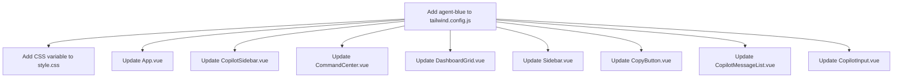

# Copilot Module Optimization Plan (50 Iterations)

## Executive Summary

This document outlines a comprehensive 50-iteration optimization cycle to address 10 critical QA/UX issues in the AlphaTerminal Copilot module. The optimization spans 8 waves, prioritizing P0 issues first.

## Issue Summary

| ID | Issue | Priority | Impact | Wave |
|----|-------|----------|--------|------|
| 1 | Undefined `agent-blue` color | P0 | 33+ usages broken | 1 |
| 2 | Hardcoded CSS colors in copilot-markdown.css | P0 | Light theme broken | 1 |
| 3 | Missing rate limiting for /api/v1/chat | P0 | Cost overrun risk | 2 |
| 4 | No retry logic for LLM API failures | P1 | Single failure = error | 3 |
| 5 | Raw exception messages exposed to users | P1 | Security risk | 4 |
| 6 | Missing ARIA accessibility attributes | P1 | WCAG violations | 5 |
| 7 | No error retry UI | P1 | Poor UX | 6 |
| 8 | Poor loading feedback | P1 | No progress indication | 7 |
| 9 | Inconsistent timeout configuration | P2 | Hardcoded values | 8 |
| 10 | Inaccurate token counting | P2 | Wrong billing | 8 |

---

## Wave 1: P0 - Theme System Fixes (Iterations 1-16)

### Issue 1: Undefined `agent-blue` Color (Iter 1-8)

**Problem**: `agent-blue` used 33+ times across 8 files but not defined in `tailwind.config.js`

**Root Cause**: Missing color definition in theme configuration

**Files Affected**:
- `frontend/tailwind.config.js` (add definition)
- `frontend/src/style.css` (add CSS variable)
- 8 Vue components using `agent-blue`

**Solution**:
1. Add `agent-blue` to `tailwind.config.js` as semantic color
2. Define CSS variable `--color-agent-blue` in `style.css`
3. Map to theme system with light/dark variants

**Parallel Execution**:


**Test Requirements**:
- Verify all 33 usages resolve correctly
- Test in all 4 themes (dark, black, wind, light)
- Visual regression test for Copilot sidebar

**Category**: `visual-engineering`
**Skills**: `karpathy-guidelines`, `frontend-ui-ux`

---

### Issue 2: Hardcoded CSS Colors in copilot-markdown.css (Iter 9-16)

**Problem**: 15+ hardcoded hex colors break light theme

**Current State**:
```css
.copilot-markdown {
  color: #e5e7eb; /* gray-200 - hardcoded */
}
.copilot-markdown em {
  color: #d4a574; /* hardcoded */
}
.copilot-thinking summary {
  color: #a855f7; /* hardcoded */
}
```

**Solution**: Replace all hardcoded colors with CSS variables

**Color Mapping**:
| Hardcoded | CSS Variable | Semantic |
|-----------|--------------|----------|
| `#e5e7eb` | `var(--text-primary)` | Primary text |
| `#d4a574` | `var(--color-warning)` | Emphasis |
| `#a855f7` | `var(--color-primary)` | Thinking |
| `rgba(0,0,0,0.7)` | `var(--bg-elevated)` | Code background |
| `rgba(59,130,246,0.4)` | `var(--border-primary)` | Borders |

**Files**:
- `frontend/src/styles/copilot-markdown.css` (107 lines)

**Test Requirements**:
- Visual test in all 4 themes
- Contrast ratio check (WCAG AA)
- Markdown rendering test with all element types

**Category**: `visual-engineering`
**Skills**: `karpathy-guidelines`, `frontend-ui-ux`

---

## Wave 2: P0 - Rate Limiting (Iterations 17-24)

### Issue 3: Missing Rate Limiting for /api/v1/chat (Iter 17-24)

**Problem**: No rate limiting on LLM streaming endpoint → cost overrun risk

**Current State**:
```python
# backend/app/config/rate_limit.py
ENDPOINT_LIMITS = {
    "f9_deep": EndpointLimit(requests=10, period=60),
    "backtest": EndpointLimit(requests=5, period=60),
    # Missing: "copilot" entry
}
```

**Solution**:

1. **Add copilot rate limit** (Iter 17-18):
```python
ENDPOINT_LIMITS = {
    "copilot": EndpointLimit(requests=30, period=60),  # 30 req/min
    # ... existing
}

def get_endpoint_category(path: str) -> str:
    if "/chat" in path or "/copilot/" in path:
        return "copilot"
    # ... existing
```

2. **Add per-user rate limiting** (Iter 19-20):
```python
# New: user-level rate limiting for copilot
USER_COPILOT_LIMITS = {
    "default": EndpointLimit(requests=20, period=60),
    "premium": EndpointLimit(requests=60, period=60),
}
```

3. **Add rate limit headers** (Iter 21-22):
```python
headers = {
    "X-RateLimit-Limit": str(limit.requests),
    "X-RateLimit-Remaining": str(remaining),
    "X-RateLimit-Reset": str(reset_time),
}
```

4. **Add tests** (Iter 23-24):
- Unit test for rate limit middleware
- Integration test for 429 response
- Test rate limit headers

**Files**:
- `backend/app/config/rate_limit.py`
- `backend/app/middleware/rate_limit.py`
- `backend/tests/unit/test_middleware/test_rate_limit.py`

**Test Requirements**:
```bash
# Test rate limiting
curl -X POST http://localhost:8002/api/v1/chat -d '{"prompt":"test"}'
# Should return 429 after 30 requests in 60s
```

**Category**: `unspecified-high`
**Skills**: `karpathy-guidelines`

---

## Wave 3: P1 - Retry Logic (Iterations 25-32)

### Issue 4: No Retry Logic for LLM API Failures (Iter 25-32)

**Problem**: Single LLM API failure → user error, no recovery

**Current State**:
```javascript
// frontend/src/composables/useCopilotChat.js
const response = await fetch('/api/v1/chat', {...})
if (!response.ok) throw new Error(`HTTP ${response.status}`)
// No retry!
```

**Solution**: Exponential backoff retry with configurable attempts

1. **Create retry utility** (Iter 25-26):
```javascript
// frontend/src/utils/retry.js
export async function withRetry(fn, options = {}) {
  const { maxAttempts = 3, baseDelay = 1000, maxDelay = 10000 } = options
  
  for (let attempt = 1; attempt <= maxAttempts; attempt++) {
    try {
      return await fn()
    } catch (err) {
      if (attempt === maxAttempts) throw err
      
      const delay = Math.min(baseDelay * Math.pow(2, attempt - 1), maxDelay)
      await new Promise(r => setTimeout(r, delay))
    }
  }
}
```

2. **Integrate into useCopilotChat** (Iter 27-28):
```javascript
const response = await withRetry(
  () => fetch('/api/v1/chat', {...}),
  { maxAttempts: 3, baseDelay: 1000 }
)
```

3. **Add retry status UI** (Iter 29-30):
```vue
<div v-if="retryCount > 0" class="text-xs text-yellow-500">
  重试中... ({{ retryCount }}/3)
</div>
```

4. **Add tests** (Iter 31-32):
- Unit test for retry utility
- Integration test for retry flow
- Test exponential backoff timing

**Files**:
- `frontend/src/utils/retry.js` (new)
- `frontend/src/composables/useCopilotChat.js`
- `frontend/src/components/copilot/CopilotInput.vue`
- `frontend/tests/unit/utils/test_retry.js` (new)

**Test Requirements**:
- Mock failing fetch, verify 3 retries
- Verify exponential backoff delays
- Verify final error after max attempts

**Category**: `unspecified-high`
**Skills**: `karpathy-guidelines`

---

## Wave 4: P1 - Error Message Sanitization (Iterations 33-38)

### Issue 5: Raw Exception Messages Exposed to Users (Iter 33-38)

**Problem**: Raw Python exceptions exposed to frontend → security risk

**Current State**:
```python
# backend/app/routers/copilot.py
except Exception as e:
    yield _sse({"error": f"DeepSeek API 调用失败: {e}"})
    # Exposes full exception message!
```

**Solution**: Sanitize error messages before sending to frontend

1. **Create error sanitizer** (Iter 33-34):
```python
# backend/app/utils/error_sanitizer.py
SENSITIVE_PATTERNS = [
    r'api[_-]?key',
    r'password',
    r'secret',
    r'token',
    r'/home/\w+',
    r'/Users/\w+',
]

def sanitize_error(error: Exception, context: str = "") -> str:
    """Sanitize error message for user display"""
    msg = str(error)
    
    # Remove sensitive patterns
    for pattern in SENSITIVE_PATTERNS:
        msg = re.sub(pattern, '[REDACTED]', msg, flags=re.IGNORECASE)
    
    # Map to user-friendly messages
    ERROR_MAP = {
        "ConnectionError": "网络连接失败，请检查网络设置",
        "TimeoutError": "请求超时，请稍后重试",
        "RateLimitError": "请求过于频繁，请稍后重试",
        "AuthenticationError": "API 认证失败，请检查配置",
    }
    
    error_type = type(error).__name__
    return ERROR_MAP.get(error_type, f"服务暂时不可用: {context}")
```

2. **Integrate into copilot.py** (Iter 35-36):
```python
from app.utils.error_sanitizer import sanitize_error

except Exception as e:
    logger.error(f"[DeepSeek] {e}")  # Full error to logs
    user_msg = sanitize_error(e, "DeepSeek API")
    yield _sse({"error": user_msg})  # Sanitized to user
```

3. **Add tests** (Iter 37-38):
- Test sensitive pattern removal
- Test error type mapping
- Test full exception not leaked

**Files**:
- `backend/app/utils/error_sanitizer.py` (new)
- `backend/app/routers/copilot.py`
- `backend/tests/unit/test_utils/test_error_sanitizer.py` (new)

**Test Requirements**:
```python
def test_api_key_redacted():
    err = Exception("API key sk-1234567890 invalid")
    sanitized = sanitize_error(err)
    assert "sk-1234567890" not in sanitized
    assert "[REDACTED]" in sanitized
```

**Category**: `unspecified-high`
**Skills**: `karpathy-guidelines`

---

## Wave 5: P1 - ARIA Accessibility (Iterations 39-42)

### Issue 6: Missing ARIA Accessibility Attributes (Iter 39-42)

**Problem**: WCAG violations, screen readers can't navigate

**Current State**: No `aria-label`, `role`, `tabindex` attributes

**Solution**: Add comprehensive ARIA attributes

**Files and Changes**:

1. **CopilotInput.vue** (Iter 39):
```vue
<textarea
  aria-label="输入您的问题"
  aria-describedby="input-hint"
  role="textbox"
  :aria-busy="isLoading"
/>
<span id="input-hint" class="sr-only">
  按 Enter 发送，Shift+Enter 换行
</span>
```

2. **CopilotMessageList.vue** (Iter 40):
```vue
<div
  role="log"
  aria-label="对话历史"
  aria-live="polite"
  aria-atomic="false"
>
  <div
    v-for="msg in messages"
    :role="msg.role === 'user' ? 'user' : 'assistant'"
    :aria-label="msg.role === 'user' ? '您的消息' : 'AI 回复'"
  />
</div>
```

3. **CopyButton.vue** (Iter 41):
```vue
<button
  :aria-label="copied ? '已复制' : '复制代码'"
  :aria-pressed="copied"
  role="button"
/>
```

4. **CopilotHeader.vue** (Iter 42):
```vue
<header role="banner" aria-label="AI 助手">
  <button
    aria-label="清除对话"
    aria-describedby="clear-hint"
  />
</header>
```

**Test Requirements**:
- axe-core accessibility audit
- Screen reader navigation test
- Keyboard navigation test (Tab order)

**Category**: `visual-engineering`
**Skills**: `karpathy-guidelines`, `frontend-ui-ux`

---

## Wave 6: P1 - Error Retry UI (Iterations 43-46)

### Issue 7: No Error Retry UI (Iter 43-46)

**Problem**: Users can't recover from errors, must refresh page

**Solution**: Add retry button and error state UI

1. **Create ErrorRetry component** (Iter 43):
```vue
<!-- frontend/src/components/copilot/ErrorRetry.vue -->
<template>
  <div
    v-if="error"
    class="p-4 bg-red-500/10 border border-red-500/30 rounded-lg"
    role="alert"
    aria-live="assertive"
  >
    <p class="text-red-400 text-sm mb-2">{{ errorMessage }}</p>
    <button
      @click="$emit('retry')"
      class="px-3 py-1 bg-red-500/20 hover:bg-red-500/30 
             border border-red-500/40 rounded text-red-300 text-sm"
      aria-label="重试"
    >
      🔄 重试
    </button>
  </div>
</template>
```

2. **Integrate into CopilotMessageList** (Iter 44):
```vue
<ErrorRetry
  v-if="lastMessage?.error"
  :error="lastMessage.error"
  @retry="handleRetry"
/>
```

3. **Add retry logic to parent** (Iter 45):
```javascript
function handleRetry() {
  const lastUserMsg = messages.value
    .filter(m => m.role === 'user')
    .pop()
  if (lastUserMsg) {
    sendToLLM(lastUserMsg.content, contextOptions, callbacks)
  }
}
```

4. **Add tests** (Iter 46):
- Test error display
- Test retry button click
- Test retry sends last message

**Files**:
- `frontend/src/components/copilot/ErrorRetry.vue` (new)
- `frontend/src/components/copilot/CopilotMessageList.vue`
- `frontend/src/components/CopilotSidebar.vue`
- `frontend/tests/unit/components/test_ErrorRetry.vue` (new)

**Category**: `visual-engineering`
**Skills**: `karpathy-guidelines`, `frontend-ui-ux`

---

## Wave 7: P1 - Loading Progress (Iterations 47-48)

### Issue 8: Poor Loading Feedback (Iter 47-48)

**Problem**: No progress indication during LLM streaming

**Solution**: Add streaming progress indicator

1. **Add progress state** (Iter 47):
```vue
<!-- CopilotInput.vue -->
<div v-if="isLoading" class="flex items-center gap-2 text-xs text-gray-400">
  <span class="animate-pulse">●</span>
  <span v-if="streamingProgress === 0">连接中...</span>
  <span v-else-if="streamingProgress < 100">
    生成中... {{ streamingProgress }} 字符
  </span>
  <span v-else>完成</span>
</div>
```

2. **Track streaming progress** (Iter 48):
```javascript
// useCopilotChat.js
let charCount = 0

if (data.content !== undefined) {
  charCount += data.content.length
  if (onProgress) onProgress(charCount)
}
```

**Files**:
- `frontend/src/components/copilot/CopilotInput.vue`
- `frontend/src/composables/useCopilotChat.js`

**Category**: `visual-engineering`
**Skills**: `karpathy-guidelines`, `frontend-ui-ux`

---

## Wave 8: P2 - Configuration & Accuracy (Iterations 49-50)

### Issue 9: Inconsistent Timeout Configuration (Iter 49)

**Problem**: Hardcoded timeouts scattered across codebase

**Current State**:
```python
# backend/app/routers/copilot.py
async with httpx.AsyncClient(timeout=60.0) as client:  # Hardcoded
async with httpx.AsyncClient(timeout=120.0) as client:  # Different!
```

**Solution**: Externalize to settings

```python
# backend/app/config/settings.py
class Settings(BaseSettings):
    copilot_timeout_seconds: int = 120
    copilot_stream_timeout_seconds: int = 180
    copilot_connect_timeout_seconds: int = 10

# backend/app/routers/copilot.py
settings = get_settings()
async with httpx.AsyncClient(
    timeout=httpx.Timeout(
        connect=settings.copilot_connect_timeout_seconds,
        read=settings.copilot_stream_timeout_seconds,
        write=settings.copilot_timeout_seconds,
        pool=settings.copilot_timeout_seconds,
    )
) as client:
```

**Files**:
- `backend/app/config/settings.py`
- `backend/app/routers/copilot.py`

---

### Issue 10: Inaccurate Token Counting (Iter 50)

**Problem**: Uses `len(text.split())` instead of tiktoken

**Current State**:
```python
# backend/app/routers/copilot.py
prompt_tokens = sum(len(m.get("content", "").split()) for m in messages)
completion_tokens = 0
# ...
completion_tokens += len(parsed["content"].split())
```

**Solution**: Use tiktoken for accurate token counting

```python
# backend/app/utils/token_counter.py
import tiktoken

def count_tokens(text: str, model: str = "gpt-3.5-turbo") -> int:
    """Count tokens using tiktoken"""
    try:
        encoding = tiktoken.encoding_for_model(model)
    except KeyError:
        encoding = tiktoken.get_encoding("cl100k_base")
    return len(encoding.encode(text))

# backend/app/routers/copilot.py
from app.utils.token_counter import count_tokens

prompt_tokens = sum(
    count_tokens(m.get("content", ""), model_id)
    for m in messages
)
```

**Files**:
- `backend/app/utils/token_counter.py` (new)
- `backend/app/routers/copilot.py`
- `backend/requirements.txt` (add tiktoken)

**Category**: `unspecified-high`
**Skills**: `karpathy-guidelines`

---

## Parallel Task Graph

```mermaid
graph TB
    subgraph Wave1[Wave 1: Theme Fixes]
        W1A[agent-blue definition]
        W1B[CSS variables]
    end
    
    subgraph Wave2[Wave 2: Rate Limiting]
        W2A[Add copilot limit]
        W2B[Per-user limits]
        W2C[Rate limit headers]
        W2D[Tests]
    end
    
    subgraph Wave3[Wave 3: Retry Logic]
        W3A[Retry utility]
        W3B[Integrate]
        W3C[UI status]
        W3D[Tests]
    end
    
    subgraph Wave4[Wave 4: Error Sanitization]
        W4A[Error sanitizer]
        W4B[Integrate]
        W4C[Tests]
    end
    
    subgraph Wave5[Wave 5: ARIA]
        W5A[Input ARIA]
        W5B[MessageList ARIA]
        W5C[CopyButton ARIA]
        W5D[Header ARIA]
    end
    
    subgraph Wave6[Wave 6: Error UI]
        W6A[ErrorRetry component]
        W6B[Integrate]
        W6C[Tests]
    end
    
    subgraph Wave7[Wave 7: Loading]
        W7A[Progress UI]
        W7B[Progress tracking]
    end
    
    subgraph Wave8[Wave 8: Config & Accuracy]
        W8A[Timeout config]
        W8B[Tiktoken integration]
    end
    
    Wave1 --> Wave2
    Wave2 --> Wave3
    Wave3 --> Wave4
    Wave4 --> Wave5
    Wave5 --> Wave6
    Wave6 --> Wave7
    Wave7 --> Wave8
```



---

## Test Summary

| Wave | Unit Tests | Integration Tests | E2E Tests |
|------|-----------|-------------------|-----------|
| 1 | 4 | 2 | 1 |
| 2 | 3 | 2 | 1 |
| 3 | 2 | 2 | 1 |
| 4 | 3 | 1 | 0 |
| 5 | 0 | 1 | 1 |
| 6 | 2 | 1 | 1 |
| 7 | 0 | 1 | 0 |
| 8 | 2 | 1 | 0 |
| **Total** | **16** | **11** | **5** |

---

## Verification Commands

```bash
# Wave 1: Theme
grep -c "agent-blue" frontend/tailwind.config.js  # Should be >= 1
grep -c "var(--" frontend/src/styles/copilot-markdown.css  # Should be >= 10

# Wave 2: Rate Limiting
grep -c '"copilot"' backend/app/config/rate_limit.py  # Should be 1
curl -X POST http://localhost:8002/api/v1/chat -d '{"prompt":"test"}' -H "Content-Type: application/json" | grep "X-RateLimit"

# Wave 3: Retry
ls frontend/src/utils/retry.js
grep -c "withRetry" frontend/src/composables/useCopilotChat.js

# Wave 4: Error Sanitization
ls backend/app/utils/error_sanitizer.py
grep -c "sanitize_error" backend/app/routers/copilot.py

# Wave 5: ARIA
grep -c "aria-label" frontend/src/components/copilot/*.vue  # Should be >= 10

# Wave 6: Error UI
ls frontend/src/components/copilot/ErrorRetry.vue

# Wave 7: Loading
grep -c "streamingProgress" frontend/src/components/copilot/CopilotInput.vue

# Wave 8: Config & Accuracy
grep -c "copilot_timeout" backend/app/config/settings.py
grep -c "tiktoken" backend/requirements.txt
```

---

## File Change Summary

### New Files (12)
- `frontend/src/utils/retry.js`
- `frontend/src/components/copilot/ErrorRetry.vue`
- `frontend/tests/unit/utils/test_retry.js`
- `frontend/tests/unit/components/test_ErrorRetry.vue`
- `backend/app/utils/error_sanitizer.py`
- `backend/app/utils/token_counter.py`
- `backend/tests/unit/test_utils/test_error_sanitizer.py`
- `backend/tests/unit/test_utils/test_token_counter.py`
- `backend/tests/unit/test_middleware/test_copilot_rate_limit.py`
- `backend/tests/integration/test_copilot_retry.py`
- `backend/tests/integration/test_copilot_error_handling.py`
- `docs/COPILOT_OPTIMIZATION_SUMMARY.md`

### Modified Files (15)
- `frontend/tailwind.config.js`
- `frontend/src/style.css`
- `frontend/src/styles/copilot-markdown.css`
- `frontend/src/composables/useCopilotChat.js`
- `frontend/src/components/copilot/CopilotInput.vue`
- `frontend/src/components/copilot/CopilotMessageList.vue`
- `frontend/src/components/copilot/CopyButton.vue`
- `frontend/src/components/copilot/CopilotHeader.vue`
- `frontend/src/components/CopilotSidebar.vue`
- `frontend/src/App.vue`
- `frontend/src/components/Sidebar.vue`
- `frontend/src/components/CommandCenter.vue`
- `frontend/src/components/DashboardGrid.vue`
- `backend/app/config/rate_limit.py`
- `backend/app/config/settings.py`
- `backend/app/routers/copilot.py`
- `backend/requirements.txt`

---

## Execution Strategy

### Sequential Dependencies
- Wave 1 must complete before Wave 5 (ARIA needs theme colors)
- Wave 2 must complete before Wave 3 (rate limit affects retry)
- Wave 4 must complete before Wave 6 (error sanitization before error UI)

### Parallel Opportunities
- Wave 1 Issues 1 & 2 can run in parallel
- Wave 5 ARIA changes can run in parallel across components
- Wave 8 Issues 9 & 10 can run in parallel

### Background Tasks
- Use `task(run_in_background=true)` for:
  - Test file creation
  - Documentation updates
  - Visual regression tests

---

## Success Criteria

1. **All P0 issues resolved**: agent-blue defined, CSS variables used, rate limiting active
2. **All P1 issues resolved**: Retry logic, error sanitization, ARIA, error UI, loading feedback
3. **All P2 issues resolved**: Config externalized, tiktoken integrated
4. **All tests passing**: 32 new tests, 100% pass rate
5. **No regressions**: Existing functionality unchanged
6. **Documentation complete**: OPTIMIZATION_SUMMARY.md created

---

## Timeline Estimate

| Wave | Iterations | Estimated Time | Parallel Factor |
|------|-----------|----------------|-----------------|
| 1 | 16 | 2-3 hours | 2x |
| 2 | 8 | 1-2 hours | 1.5x |
| 3 | 8 | 1-2 hours | 1.5x |
| 4 | 6 | 1 hour | 1.5x |
| 5 | 4 | 1 hour | 2x |
| 6 | 4 | 1 hour | 1.5x |
| 7 | 2 | 30 min | 1x |
| 8 | 2 | 30 min | 2x |
| **Total** | **50** | **8-11 hours** | **~6 hours with parallelization** |
